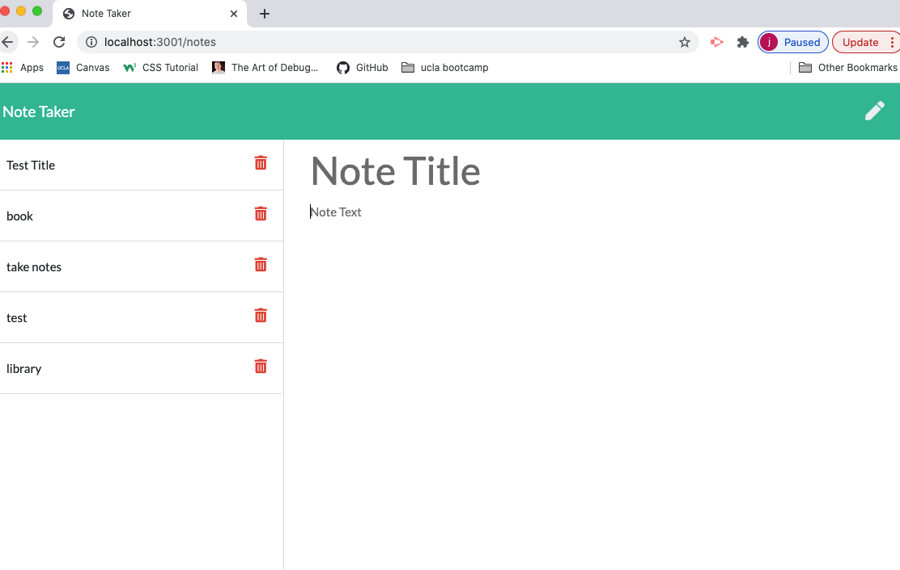
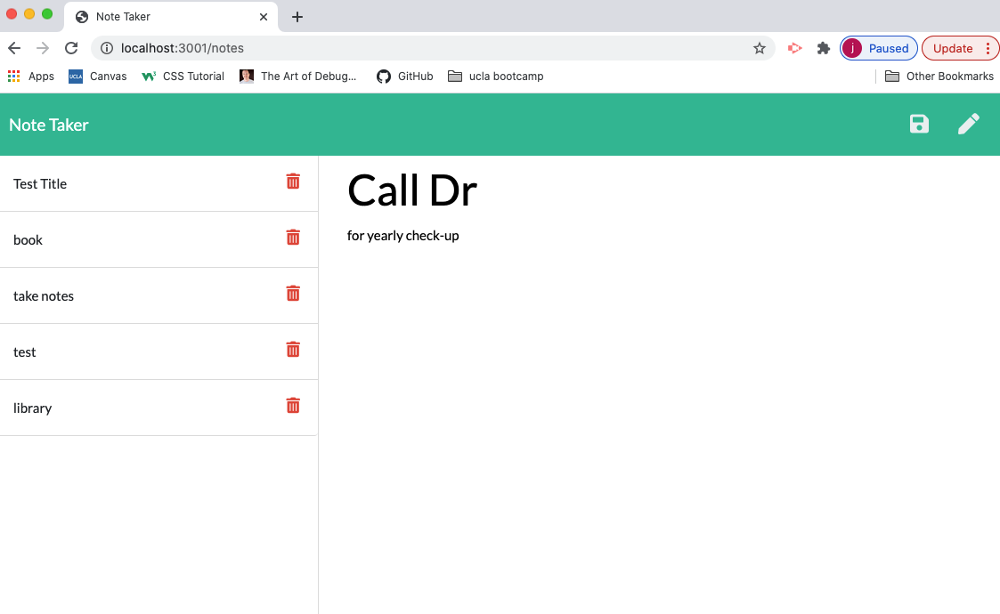

# Note-Pad

https://cleanjenn.github.io/Note-Pad/


# Table of Contents

- [Description](#description)
- [User Story](#user-story)
- [Installation](#installation)
- [Usage](#usage)
- [Mock Up](#mock-up)
- [Contributing](#contributing)
- [Questions](#questions)

# Description 

 I created an application called Note Pad that can be used to write, save, and delete notes. This application uses an Express.js back end and will save and retrieve note data from a JSON file.
 # User Story
 ```
 AS A small business owner
I WANT to be able to write and save notes
SO THAT I can organize my thoughts and keep track of tasks I need to complete
```
# Installations 
`npm init`<br />
`npm install express`<br />
`npm install node`
# Usage
```
Ability to create, save and delete notes or reminders all from one application. 
```
# Mock Up



# Contributions

[Jennifer](https://github.com/cleanjenn)

# Questions 

Feel free to contact me via email: <br /> [Email](mailto:jennifer23gomez.com)<br /> 
[Github](https://github.com/cleanjenn)<br />